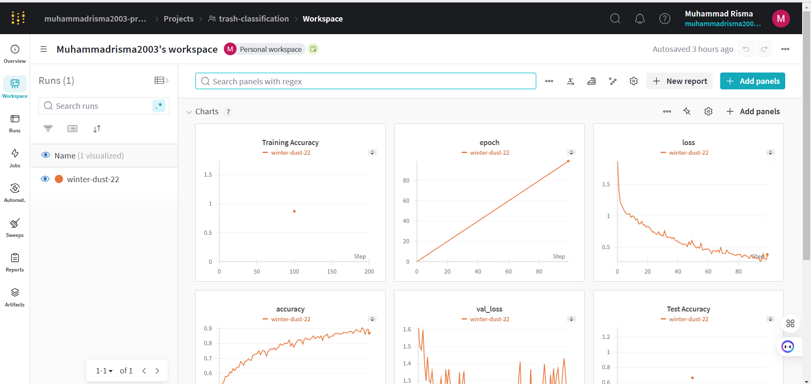
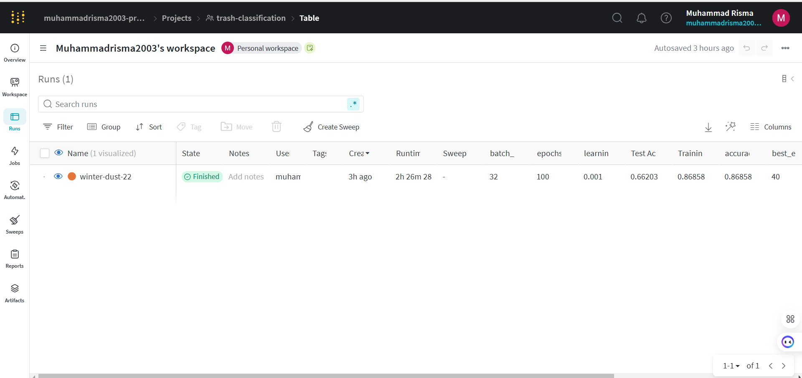
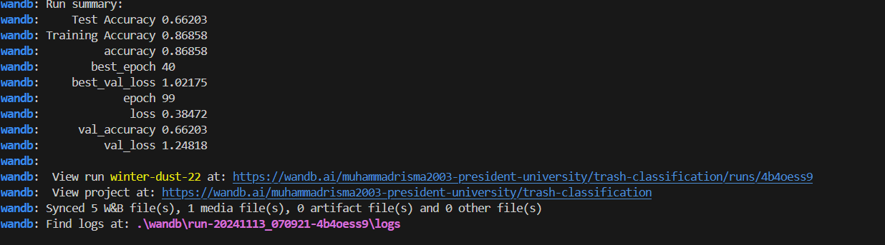

The [TrashNet dataset](https://huggingface.co/datasets/garythung/trashnet) is a labeled dataset for trash classification with six categories.

## Project Steps

### 1. Data Preparation

#### Step-by-Step Process:
- **Data Loading:** We load the dataset, ensuring that it can be split into training,and test sets (80%, 20%splits, respectively).
- **Data Augmentation:** To improve the model’s generalization ability, we augment the images during training with the following transformations:
  - **Random Flips:** Horizontal flips to make the model invariant to item orientation.
  - **Random Brightness:** Adjusts brightness, helping the model perform well under varied lighting.
  - **Random Rotations:** Introduces slight rotations to simulate varied positioning.
- **Preprocessing:** Images are resized to 224x224 pixels, and pixel values are normalized for more efficient model training.

#### Justification:
- **Augmentation** helps prevent overfitting by increasing the diversity of training samples, making the model more robust.
  
#### Pros & Cons:
- **Pros:** Augmentation improves model performance on unseen data by mimicking real-world variability.
- **Cons:** It can increase computational load and may lead to slower training.

### 2. Exploratory Image Analysis

To better understand the dataset, we perform a detailed analysis of class distributions and image characteristics:

- **Class Distribution & Class Imbalance:** Visualized the distribution of classes in the training, validation, and test sets to identify any class imbalance.
  - *Observation:* If one class is significantly underrepresented, it may lead to model bias. In such cases, we would consider using class weighting during training.

#### Pros & Cons:
- **Pros:** Helps tailor the model to specific data characteristics and address any imbalances or biases early.
- **Cons:** Adds extra steps to the workflow, though these are critical for effective model development.

### 3. Model Training & Evaluation Analysis

#### Model Architecture:
We use a Convolutional Neural Network with layers optimized for spatial pattern recognition, configured as follows:
- **Convolutional Layers:** For feature extraction (textures, shapes, edges).
- **Max Pooling Layers:** For down-sampling and reducing overfitting.
- **Dense Layers:** Fully connected layers for final classification.

#### Training Process:
- **Hyperparameters:** Batch size of 32, learning rate of 0.001, and 50 epochs. The Adam optimizer is chosen for its adaptability.
- **Experiment Tracking:** Metrics such as accuracy, loss, confusion matrix, and class-level precision/recall are tracked using [Weights & Biases](https://wandb.ai) to monitor model performance.

#### Evaluation:
- **Classification Report:** We provide precision, recall, and F1-score for each class, allowing detailed insights into model performance.
- **Confusion Matrix:** Visualizes misclassifications to understand where the model may need improvement.

#### Justification:
- **Choice of CNN:** CNNs are particularly effective for image classification tasks due to their spatial feature extraction capabilities.
- **Hyperparameters:** These values provide a good balance between training stability and performance.

#### Additional Insights:
- **Class Imbalance:** If class imbalance is significant, adjusting loss functions or applying class weights could improve model fairness.
- **Bias Identification:** Analysis of misclassified samples can help identify potential biases and areas for improvement in model training.

## Environment Setup

1. **Clone this repository:**
   ```bash
   git clone https://github.com/muhammadrisma/trashnet-classification.git
2. Install dependencies.

pip install -r requirements.txt

3. Set up environment variables.

Add a .env file with W&B and Hugging Face tokens:
WANDB_API_KEY=your_wandb_api_key
HF_TOKEN=your_huggingface_token

4. Run the Jupyter Notebook and train.py:

Open and run exploratory_analysis.ipynb for a full walkthrough of EDA of the Dataset.
Run train.py to start the training.

5. Using GitHub Actions.
GitHub Actions automates model training on code updates, ensuring reproducibility.

## Technologies and Tools
- TensorFlow/Keras: For model development and training.
- Hugging Face Datasets: For dataset management and splitting.
- Weights & Biases: For experiment tracking and metric visualization.
- GitHub Actions: Automates CI/CD for reproducible training.


## Conclusion
The model provides a robust solution for image classification, utilizing data augmentation, detailed evaluation metrics, and automated CI/CD.

- Pros: Improved accuracy, thorough data handling, and flexible experimentation setup. Or we can use Transfer learning 

- Cons: Limited by dataset quality and potential biases that might require ongoing adjustment.

Alternatively, transfer learning and more epoch could be explored to further improve performance


## WANDB:

wandb:  View run winter-dust-22 at: https://wandb.ai/muhammadrisma2003-president-university/trash-classification/runs/4b4oess9
wandb:  View project at: https://wandb.ai/muhammadrisma2003-president-university/trash-classification




## Hugingface Model
